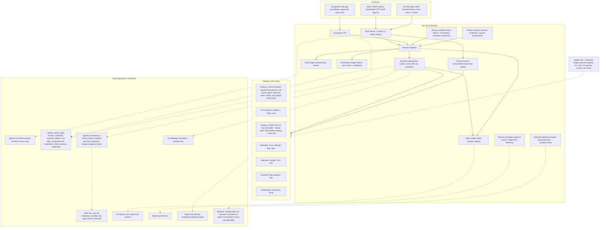

# Hirz

**House rules for the AI in your home, and your parents'.**

Hirz lets your family decide what Alexa may do on its own, what it must ask about, and what it may never do. It holds a shared model of the people, devices, schedules, energy, and trust relationships in a home, plans against household goals instead of one-off commands, and acts only inside boundaries the household wrote down. The name for that in the architecture docs is *bounded autonomy*.

> Built for the **Build, Ship, Shape: Amazon Developer Hackathon 2026**: Alexa+ track, Ring track (kept only if the Ring sandbox access gate in `ROADMAP.md` item 34 passes), and both mini-challenges, AWS Builder and Open Source. Designed as a startup, not a weekend project: see [`ROADMAP.md`](./ROADMAP.md) for the hackathon cut line and what comes after it.

---

## Who it's for

The family's household manager: the adult who set up the smart home at their own place and at their parents' place, and who carries the worry for both.

- People reported losing **$3.5 billion to imposter scams in 2025**, nearly one in three fraud reports, and nearly three times the 2020 figure ([FTC, 2026-06-15](https://www.ftc.gov/news-events/news/press-releases/2026/06/ftc-data-show-people-reported-losing-3-point-5-billion-imposter-scams-2025)).
- Fraud losses reported by adults 60 and over rose about fourfold, from about $600 million in 2020 to **$2.4 billion in 2024**, driven largely by losses over $100,000, often to investment scams, romance scams, or impersonations ([FTC, *Protecting Older Consumers 2024–2025*](https://www.ftc.gov/news-events/news/press-releases/2025/12/ftc-issues-annual-report-congress-agencys-actions-protect-older-adults)).
- **63 million Americans**, about one in four adults, are family caregivers ([AARP and the National Alliance for Caregiving, *Caregiving in the U.S. 2025*](https://www.aarp.org/press/releases/2025-07-24-new-report-reveals-crisis-point-for-americas-63-million-family-caregivers.html)).

An assistant that can unlock doors and change the thermostat while someone sleeps, in a home you are responsible for but do not live in, needs rules you can read and proof they held. Hirz is **rules, not care**: it does not do medication or health monitoring. It gives that person autonomy inside a boundary at home, and protection at their parents'. It also does not stop scam calls. It gives Mom one simple thing to do: *ask first*.

## What it does

5:05 PM, at Mom's.

> **Mom:** Alexa, Malik just called from a strange number. He says he's in trouble and needs five hundred dollars. Is it really him?
>
> **Alexa (Hirz):** This looks like a family-impersonation scam. Don't send anything yet. I'm checking with Malik on his own phone. Ask me again in a minute.

Malik's phone buzzes: *"Your mom is checking it's really you. Did you just call her from another number asking for $500?"* He taps **No, that wasn't me.** The card on Mom's Echo Show moves from *checking with Malik* to the answer. Alexa cannot speak unprompted, so Mom asks.

> **Mom:** Alexa, is it him?
>
> **Alexa (Hirz):** Malik says that wasn't him. Don't send anything.

Hirz never used anything the caller said as a fact, and it never claimed to know the caller's number: it cannot see the call, and Mom did not read the number out. It asked Malik, about this specific request, through a channel the family verified in advance.

5:31 PM, at Malik's. He is just home, and rattled.

> **Malik:** Alexa, from now on, never unlock the door for someone we're not expecting.
>
> **Alexa (Hirz):** I've written that as a rule and sent it to your phone. It won't take effect until you approve it there.

On his phone: one English sentence, what changes in concrete situations (*Unexpected visitor: ask on phone → never. Expected arrival: still asks on your phone. Hirz does not identify the visitor.*), the compiled policy underneath. Those lines are computed by running the old and the new rules over a fixed set of situations; no model writes them. He activates it with his passkey. Anyone in the room can propose a rule. Only a person on their own phone can activate one.

> **Malik:** What's going on tonight?
>
> **Alexa (Hirz):** You're in the peak window until 7. I'll run the house off the battery, warm the living room for your mom, and hold the car until after 9.

The screen shows the plan as a card: what it saves tonight, three rows, one Approve button. He changes it by voice ("don't charge the car past 50, I'm not driving tomorrow"). Alexa confirms the constraint at once ("Got it, the car stops at 50. I'm updating the plan."), the card refreshes when the new plan lands a moment later, and only then does he say "do it". Hirz never lets him approve a plan that is still being recomputed.

At 6:40 the doorbell rings and nobody is expected. "Let them in."

> **Alexa (Hirz):** You added a rule tonight: I never unlock for someone who isn't expected.

At 7:04 it rings again. A vehicle pulled in at 6:58, and Mom is expected at 7:00. "That's my mom, let her in."

> **Alexa (Hirz):** Unlocking the door needs your approval on your phone. I've sent it.

The phone does not say "unlock for Mom". It says *"Someone is at the front door. Mom is expected now. Unlock for 10 minutes?"* A schedule is context, not identity: Malik is the one who confirms who is there.

Same lock, two outcomes. *Never*, because the family said so an hour ago. *Ask*, on a phone, never by voice, because an Echo is a shared device and Alexa does not tell add-ons who is speaking.

Every one of those sentences is backed by a structured record: what Hirz did, why, under which rule of the household constitution, at what risk band, and who approved it. Every number Hirz speaks comes from a cited scenario run. The demo household is on ComEd's published Time-of-Day rate, where the all-in peak price is several times the overnight price; a historical counterpart is also run on ComEd's archived Hourly feed, and the backtest table below shows both. Nothing here is typed by hand.

The headline saving is measured against what a careful household already does: the car on a timer after 9 PM, the battery on its default self-consumption mode, the dishwasher on delay start. "Do everything now" and a simple cheapest-slots strategy are shown beside it. Every strategy delivers the same comfort, the same energy into the car, and ends with the battery at its opening state of charge. On Hourly Pricing the backtest decides with the prices that were knowable at the time and is billed at the prices that actually happened. It also runs a home with a car and no solar or battery, and it reports the days on which Hirz adds little.

The retained simulation covers **2025-09-01 17:30 through 2026-09-01 17:30,
America/Chicago**, carrying every strategy's physical state across all 365 days.
Both profiles apply the pinned 2026 tariff counterfactually. Hourly costs are
feed-based supply-plus-distribution estimates, not reconciled bills; missing
quotes leave **194/365 eligible days**. The table includes battery wear at
$0.01 per internal-throughput kWh and preserves negative savings. Annualized
values extrapolate the eligible-day mean × 365; missing data may bias them.

| Rate | Household | Net saving vs timer: median (p10–p90) | vs immediate: median | vs greedy: median | Annualized extrapolation | Eligible/total |
|---|---|---|---|---|---|---|
| Time-of-Day | solar + battery + EV | $-0.24 ($-1.29–$0.52) | $1.32 | $-0.24 | $-124.47 | 365/365 |
| Time-of-Day | EV only | $0.25 ($-0.60–$0.94) | $2.64 | $0.25 | $66.68 | 365/365 |
| Time-of-Day | solar + battery, no EV | $-0.16 ($-1.36–$0.51) | $-0.16 | $-0.16 | $-103.11 | 365/365 |
| Hourly | solar + battery + EV | $0.21 ($-0.52–$0.73) | $0.48 | $0.14 | $60.02 | 194/365 |
| Hourly | EV only | $0.20 ($-0.56–$0.67) | $0.38 | $0.13 | $38.19 | 194/365 |
| Hourly | solar + battery, no EV | $0.14 ($-0.57–$0.50) | $0.14 | $0.14 | $24.82 | 194/365 |

Generated from [retained results](./scripts/backtest-data/results.json), including
wear sensitivity, observed electricity and wear costs, exclusions, losses,
exported energy, worst timer day, negative-price charging durations and coverage.
See [verification](./docs/verification-log.md#full-offline-reproduction-and-completion--2026-09-21)
and [reproduction procedures](./docs/development.md#item-17-planner-and-backtest).

## Why existing agents fall short

Alexa+ can now call third-party tools over MCP, orchestrate multi-turn conversations, and render interactive UI. Household agents built on it already follow a common pattern: an allowlist of actions, a human-approval step for the risky ones, and an audit trail. That pattern is necessary and Hirz has it. It is not sufficient, for three reasons:

1. **The boundary is the developer's, not the household's.** An allowlist is written in code by whoever built the agent. A family needs to *write* the answer to "how much authority do you have?" themselves, change it, and see proof that it was enforced somewhere the agent's own code cannot get around.
2. **Trust comes from the caller.** The same channel that takes "turn off the lights" also takes "it's me, I'm in trouble, send money". An assistant with no record of who Malik is and how to reach him can only take the caller's word for it.
3. **One user, one command at a time.** Preferences, routines, people, assets, and constraints live in ten apps and nobody's head. Energy optimizers exist (EMHASS schedules solar, a battery, and deferrable loads for Home Assistant, and Home Assistant lets a household choose which devices an assistant can see). What they do not carry is the household: whose constraint moved the dishwasher, which written rule let the battery discharge, who approved the unlock, and proof that the limit held. Hirz's claim is that combination: household-authored permissions governing coordinated automation, with authenticated exceptions and evidence of enforcement.

## What Hirz adds

Approval gates, an audit ledger, and a simulated Alexa+ host are the baseline for a household agent, and Hirz has all three. The four things below are what Hirz adds on top of that baseline.

| | What it is | Why it matters |
|---|---|---|
| **A boundary the household writes, that the home itself enforces** | A Household Constitution, proposed by voice or written as a form, as YAML, or in plain English, and always activated by a person on their own phone. It states per action class and per member what Hirz may do on its own, what it must ask about, and what it may never do. Every version compiles to a Cedar/Dogwood policy set that AgentCore Policy enforces at the AWS tool boundary, including a temporal "approval must precede action" rule. Only a permit gets a command signed, and the home-side agent, Hirz Link, obeys only signed commands. | The boundary belongs to the family, not the developer. Hirz's own processes hold no credential that can act on a device; only commands the policy engine authorized are signed, and the home obeys only signed commands, once each, addressed to that home. This covers a bug or a bypass path in Hirz's own code. It does not yet cover a fully compromised worker, which could still tell the boundary an approval happened; closing that for security actions (the passkey itself verified at the boundary) is `ROADMAP.md` item 38d, and `THREAT_MODEL.md` says No until it is built. |
| **Verification from the household's own records** | Trusted contacts have channels verified out of band at setup. A request is checked against those records and confirmed through the subject's own app or verified number, never through anything the caller supplied. A recent scam call plus an unexpected visitor at the door raises a warning. Hirz has no way to move money, by design. | "Is this really Malik?" is answered by the graph, not by the person asking. |
| **A real planner over real prices** | A rolling-horizon MILP schedules the EV, the home battery, HVAC, and appliances against the household's real rate plan (all-in, supply plus delivery) and live weather, per-occupant comfort bands, and member constraints, and reports savings against a timer schedule a careful household would already use, with "do everything now" and a cheapest-slots strategy beside it, all held to the same comfort and delivered energy. A physics twin supplies every device that is not real, labeled as simulated. | The savings on the scorecard are computed, not typed, and the binding constraints and rejected alternatives are outputs of the model rather than a story about it. |
| **Multi-member coordination with provenance** | Each constraint and preference keeps the linked account it arrived on, the surface, and the time: "Dad, 22:40: kitchen in use until 23:00" survives into the plan, the explanation, and the audit row. Alexa does not say who spoke, so provenance is the account, never the voice; a name someone merely claims is recorded as claimed. Conflicts between members are returned as data with the people involved, never silently resolved. | A household is not one user. The plan can say whose request moved the dishwasher, and why. |

Underneath all four: a deterministic risk engine whose bands set floors the constitution can tighten but never loosen, and a pipeline in which every action carries what, why, which rule, and what was rejected, as data that Alexa narrates. Those are the mechanisms that make the four hold; they are not the claim.

In local mode there is no outside boundary: the second policy evaluator runs in the same container and is labeled as exactly that. "Enforced outside Hirz" is claimed for the AWS deployment only.

**What the rules cover.** Hirz governs the actions Hirz takes. A lock that is also linked to Alexa directly, exposed to an assistant by Home Assistant, or opened with the vendor's app or a key has a path that does not pass through Hirz, and Hirz cannot refuse what it never sees. The deployment rule is that a device Hirz governs is not exposed to Alexa by another route; the Household page shows each device as *managed through Hirz* or *not managed*; and when a governed device changes state without a command from Hirz, that is recorded as *changed outside Hirz* and, for locks and cameras, the owner is told. A manual thermostat change is respected for a while rather than overwritten. `THREAT_MODEL.md` has the row.

## Architecture


*Observe → Understand → Plan → Evaluate Risk → Check Authority → Act → Verify → Remember. Every action Hirz takes passes through that loop, and every step of it is recorded.*

Every box is a module described in [`ARCHITECTURE.md`](./ARCHITECTURE.md). Surfaces talk to Hirz Core only through MCP tools or the companion API; Core talks to the world only through adapters, each of which has a real implementation and a **digital-twin** implementation behind the same interface.



**The decision pipeline, in order.** A proposed action is resolved by one deterministic, ordered pipeline (full detail in `ARCHITECTURE.md` §3):

```
1. Identity + role resolution      → unknown requester → least authority
2. Constitution NEVER              → DENY (terminal)
3. Risk floor                      → CRITICAL → DENY or VERIFY (terminal)
4. Constitution mode + conditions  → auto | ask | never
5. Risk band escalation            → HIGH forces ASK even where the constitution says auto
6. Budgets and rate limits         → daily $ limit, action counts → ASK or DENY
7. Boundary enforcement (Cedar)    → AgentCore Policy must agree; disagreement fails closed
8. → EXECUTE | ASK | DENY | VERIFY    (EXECUTE on a home device = a command the boundary signed, verified in the home)
```

## Tech stack

| Layer | Choice | Why |
|---|---|---|
| Core | Python 3.12, FastAPI, official `mcp` SDK (FastMCP), async throughout | First-party MCP SDK; same stack as the author's prior MCP work; AgentCore Runtime's MCP contract is Python-first |
| Planner | `scipy.optimize.milp` (HiGHS) rolling-horizon scheduler | Deterministic, explainable, one dependency; no LLM in the optimization loop ([ADR-005](./docs/adr/ADR-005-deterministic-planner.md)) |
| Policy | YAML constitution + Pydantic schema + a non-Turing-complete condition grammar, compiled to Cedar | Git-diffable, validated at load, analyzable; enforced in-process and at the AWS tool boundary ([ADR-003](./docs/adr/ADR-003-constitution-yaml-to-cedar.md)) |
| Risk | Fixed action-class table + dynamic factors, **no ML** | A household decision the family can't explain is one they can't trust ([ADR-004](./docs/adr/ADR-004-no-ml-risk-scoring.md)) |
| Storage | PostgreSQL 16 (household graph, constitution versions, plans, approvals, audit chain) + AgentCore Memory (conversational, preference extraction) | Relational integrity for a hash chain; graph as tables + JSONB ([ADR-002](./docs/adr/ADR-002-postgres-over-dynamodb.md)) |
| Surfaces | React + TypeScript: MCP App cards (`@modelcontextprotocol/ext-apps`, plain CSS carrying Amazon's design tokens), companion app and simulator (Tailwind + shadcn/ui) | The MCP Apps SDK and the Alexa tooling are TypeScript ([ADR-001](./docs/adr/ADR-001-python-core-typescript-surfaces.md)); the cards follow Amazon's add-on design guide verbatim ([`docs/design.md`](./docs/design.md)) |
| Home agent | Hirz Link: a small Python process beside Home Assistant, outbound-only, executes only KMS-signed commands | The Home Assistant token never leaves the house, no tunnel, and a bypass in Hirz's own processes has nothing to act with ([ADR-009](./docs/adr/ADR-009-signed-commands-home-agent.md)) |
| Open source | A separate repository: an add-on conformance checker (CLI, black-box against any MCP server) and the simulator's generic host harness | Add-on developer access is limited to select partners, so builders test against emulated hosts; the checker tells any of them in one command whether a server meets Amazon's published contract. Hirz's simulator is built on the published harness and its CI runs the checker |
| Alexa+ | MCP 2025-11-25, Streamable HTTP, OAuth 2.1 + PKCE S256, Protected Resource Metadata, MCP Apps for visuals | The add-on contract, verbatim ([ADR-007](./docs/adr/ADR-007-alexa-surface-strategy.md)) |
| AWS | AgentCore Runtime, Gateway, Policy, Memory, Identity; Bedrock (Claude Haiku 4.5 / Sonnet 5; the emulator runs Haiku 4.5 by default with Nova Lite selectable); EventBridge Scheduler + Lambda; KMS (command signing); S3 Object Lock (audit anchors); CDK (TypeScript) | AWS runs Hirz's agentic state and enforcement, not just its hosting ([ADR-008](./docs/adr/ADR-008-agentcore-topology.md)) |
| Twin | Physics-lite models with a simulated clock and a YAML scenario DSL | Everything is demonstrable end to end with no hardware, and every scenario is an integration test ([ADR-006](./docs/adr/ADR-006-twin-first-adapters.md)) |
| Ops | Docker Compose (Postgres, Home Assistant demo, Hirz), OpenTelemetry → CloudWatch via AgentCore Observability, GitHub Actions (ruff / mypy strict / pytest 80% gate / tsc / vitest / playwright) | |

## Repository layout

```
Hirz/
├── README.md, ARCHITECTURE.md, THREAT_MODEL.md, ROADMAP.md, SECURITY.md, CHANGELOG.md
├── CLAUDE.md, AGENTS.md            # instruction files for coding agents (kept at parity)
├── docs/
│   ├── adr/                        # one file per consequential decision
│   ├── constitution.md             # the Household Constitution spec
│   ├── tool-catalog.md             # every MCP tool: name, schema, output, voice fallback
│   ├── twin-and-scenarios.md       # digital twin models and the scenario DSL
│   ├── design.md                   # Amazon's design tokens, per-card specs, the seven hand-designed screens
│   ├── demo-script.md              # the 3-minute video, beat by beat
│   └── submission.md               # hackathon requirements checklist
├── hirz/                          # Python core package
│   ├── graph/                      # household graph models, repository, versioning
│   ├── constitution/               # schema, loader, condition grammar, Cedar compiler, evaluator
│   ├── risk/                       # action classes, factors, bands
│   ├── pipeline/                   # the decision pipeline and the canonical Decision
│   ├── planner/                    # MILP scheduler, coordinator, plan diff
│   ├── executor/                   # action runtime, scheduler, verify-after-act
│   ├── protect/                    # trusted contacts, verification, request assessment
│   ├── explain/                    # Bedrock-backed explainer (structured in, structured out)
│   ├── audit/                      # hash chain, signing, export, verifier
│   ├── adapters/                   # one package per domain; each has real/ and twin/
│   ├── twin/                       # physics models, sim clock, scenario engine
│   ├── link/                       # Hirz Link: the home agent that obeys only signed commands
│   ├── mcp/                        # MCP server, tools, OAuth PRM, MCP App resources
│   ├── api/                        # companion API (FastAPI)
│   └── cli.py                      # hirz CLI: decide, plan, scenario, verify-audit, doctor
├── apps/
│   ├── mcp-app/                    # React MCP App bundle (plan card, approval card, verification card, scorecard)
│   └── web/                        # one React app: companion pages + the Alexa+ simulator route (emulator agent, voice, device modes)
├── infra/cdk/                      # AWS CDK (TypeScript): AgentCore, Cognito, Bedrock access, scheduler, RDS
├── scenarios/                      # YAML scenarios (the parents' scam check, the demo evening, test fixtures)
├── constitutions/                  # quinn-home (Malik's), quinn-parents (Mom and Dad's), examples
├── tariffs/                        # published rate tables with source URLs (ComEd Time-of-Day)
├── compose.dev.yml, compose.demo.yml, compose.link.yml
├── alembic/                        # Postgres migrations
├── scripts/
└── tests/{unit,integration,adversarial,scenarios,ux,latency}
```

## Scaffold setup (Phase 0, items 1–3)

The Python package has a liveness endpoint, local-development bootstrap checks,
the foundation and versioned household graph managed by Alembic, and `hirz doctor`.
Item 6 adds explicit demo seeding and redacted current/historical context reads;
see [graph development procedures](./docs/development.md). The `web` and `mcp-app`
workspaces still contain import smoke tests only. The internal decision pipeline
and read-only `hirz decide` preview now exist; device execution remains pending.
See [decision preview prerequisites](./docs/development.md#decision-preview-item-11).

Verified toolchain: Python **3.12.13**, uv **0.12.15**, Node **24.21.0**, and pnpm
**12.4.2**. Python is selected by `.python-version`; pnpm is recorded in
`package.json`. Direct dependencies are pinned exactly, with both lockfiles checked in.

On macOS with Homebrew, install the tools and select Node 24 for this shell only
(Homebrew installs its currently available versions):

```bash
brew install uv pnpm node@24
export PATH="$(brew --prefix node@24)/bin:$PATH"
```

From the repository root:

```bash
uv sync --locked
pnpm install --frozen-lockfile
# First build/export the pinned Dogwood CLI (docs/development.md, item 7).
uv run pytest
uv run ruff check .
uv run ruff format --check .
uv run mypy hirz/ scripts/ alembic/
pnpm -r lint
pnpm -r typecheck
pnpm -r test
uv build
```

Default Python tests cover package metadata, liveness, bootstrap credential/protocol
handling, key recovery, and doctor output/failures. Each TypeScript workspace tests
its empty module import. Python enforces **80% line coverage over `hirz/`**; scaffold
coverage alone is not evidence of policy enforcement or device behavior. No cloud credentials,
Docker services, or browser are needed for default tests; the WebSocket test binds
a temporary local port. Live database tests are selected explicitly below.

## Continuous integration (Phase 0, item 4)

The [CI workflow](.github/workflows/ci.yml) runs on pushes, pull requests, and
manual dispatch using Ubuntu 24.04 x64 and the pinned toolchain above. It runs
Python lint/types/tests with the 80% coverage gate, TypeScript lint/types/Vitest,
Python package and fresh-wheel checks, and Docker build/non-root checks.
The Python test job initializes an isolated Compose stack and runs migrations,
`alembic check`, doctor, authenticated service checks, and the live PostgreSQL
tests. Generated credentials stay in the runner's ignored `.env`; cleanup removes
only that run's containers, volumes, and credentials.

All eleven architecture job IDs are present. Scenarios, add-on conformance,
latency, Cedar conformance, and release are **successful placeholders** with
explicit deferral messages in their logs and job summaries. Browser tests and
frontend bundles are also deferred. No AWS secrets or publication are involved.
There are no cross-run dependency/Docker caches or artifact uploads.

On GitHub, open **Actions → CI → Run workflow** for manual dispatch.
Phase 0 item 4 is complete (2026-09-17): all eleven jobs passed in the
[main run](https://github.com/BashaarJavaid/Hirz/actions/runs/35310102678).
Green placeholders do not claim application behavior or protection. Item 5
was subsequently completed as recorded in [the roadmap](./ROADMAP.md).

## Local development stack (Phase 0, items 2–3)

Start Docker before running these commands from the repository root:

```bash
uv sync --locked
uv run python scripts/init_dev.py
docker compose -f compose.dev.yml up -d --build
uv run alembic upgrade head
uv run hirz doctor
uv run python scripts/check_dev.py
```

The initializer creates missing local credentials in ignored `.env` (mode `0600`),
starts Postgres and Home Assistant, completes HA onboarding, and saves a 365-day
long-lived token. It also creates an unencrypted PKCS#8 P-256 private key as a
quoted multiline `AUDIT_SIGNING_KEY`, only after confirming an empty audit database.
It preserves existing credentials, valid keys, and unrelated `.env` entries;
rerunning it reuses a valid token. Do not run initializers concurrently. Initial
image downloads can take several minutes; readiness waits are bounded to 180 seconds.
Use a regular, nonsymlink `.env` with mode `0600` for these credentials, not competing
shell environment variables. Commands run from the checkout root; the database/user
are `hirz` at `127.0.0.1:5432`, and HA is at `http://127.0.0.1:8123`. Endpoint
configuration for deployment is deferred.

| Service | Address | What exists now |
|---|---|---|
| Hirz | <http://localhost:8000/health> | `200 {"status":"ok"}`; process liveness only |
| Home Assistant | <http://localhost:8123> | Real API, demo devices (**simulated**) |
| PostgreSQL | `localhost:5432` | Database/user `hirz`; foundation, graph/history, and context view after migration |
| Jaeger, optional | <http://localhost:16686> | In-memory traces; no Hirz instrumentation yet |

All published ports bind to `127.0.0.1`. Hirz has no `/ready`, MCP, API docs, worker,
or companion pages yet. Its runtime contains no device credentials. The development
container sets `HIRZ_LLM=off` and needs no AWS account. HA uses “Hirz Demo,” English,
`America/Chicago`, US customary units, username `hirz`, and display name “Hirz Developer.”
Retrieve the generated password privately from `.env` to sign into HA.

HA's unmodified demo integration supplies the entities; the checker requires
`climate.ecobee`, `cover.garage_door`, `light.bed_light`, and
`sensor.outside_temperature`. Native onboarding also initializes `google_translate`,
`met`, `radio_browser`, and `shopping_list`, plus frontend dependencies. Analytics
sharing stays off. These are demo infrastructure, not household actions; neither
script calls device services or substitutes for the future decision pipeline.

HA's [installation guide](https://www.home-assistant.io/installation/linux/)
excludes Docker Desktop from its supported Container setup. This demo-only stack
passed on macOS ARM64 with Docker Desktop **4.87.0**, Engine **29.7.2**, and Compose
**5.4.0** on **2026-09-17**; it does not establish physical-device support.
If it fails on your runtime, retain the volumes and investigate before switching
runtimes. No host networking, privileged mode, or physical-device mounts are used.

For the roadmap's direct authenticated API check, pass the header through stdin
so the token is absent from curl's command-line arguments:

```bash
uv run python -c 'from dotenv import dotenv_values; print("Authorization: Bearer " + dotenv_values(".env", interpolate=False)["HA_TOKEN"])' \
  | curl --fail --silent --show-error --header @- http://localhost:8123/api/states
```

The response contains demo entities. Without that header, HA returns `401`.
`check_dev.py` additionally checks a password-authenticated Postgres query and Hirz
liveness; it prints entity IDs and results, never credentials.

```bash
# Rebuild after Python source/dependency changes; no source mount or reload watcher.
docker compose -f compose.dev.yml up -d --build

# Optional Jaeger; OTLP ports 4317/4318 remain internal to Compose.
docker compose -f compose.dev.yml --profile observability up -d
uv run python scripts/check_dev.py --observability

# Stop all services, retaining Postgres and HA named volumes and .env.
docker compose -f compose.dev.yml --profile observability down
```

The observability check submits one disposable `hirz-dev-check` trace from inside
the Compose network and retrieves it by ID. Jaeger stores traces in memory and
loses them on restart. No tracing SDK is installed in Hirz.

**Recovery:** if HA is already onboarded and `HA_TOKEN` is absent, invalid, or
expired, sign into HA with the original credentials, finish any pending onboarding,
then create a replacement under **Profile → Security → Long-lived access tokens**.
Revoke an obsolete “Hirz local development” token before reusing its name. Save the
replacement as `HA_TOKEN` in `.env` and rerun initialization. The script does not
automatically sign in again or edit HA authentication storage. Missing credentials
for existing volumes require restoring the original `.env`; changing the Postgres
environment variable does not change a persisted database password. Inspect service
status with `docker compose -f compose.dev.yml ps`; do not publish `.env`, rendered
Compose configuration, or container inspection output containing credentials.

**Local diagnostics and migrations:** `uv run hirz doctor` prints four named
PASS/FAIL lines for password-authenticated Postgres, HA demo entities, an in-memory
P-256 sign/verify probe, and migration currency plus the presence of graph tables and `household_context`.
Each check has a ten-second deadline and no retry. All checks run; exit status is
0 only if every check passes, otherwise 1. It performs no repairs, migrations,
audit writes, or device actions. It does not check full schema drift, constitution
compilation, or AWS yet. There is no `--json` or `--aws` mode in item 3.

Apply migrations explicitly with `uv run alembic upgrade head`; neither the server
nor initialization applies them. `uv run alembic check` compares the schema with
Core metadata for Alembic-supported differences. **`uv run alembic downgrade base`
destroys the application tables, graph history, and their data**; use it only on disposable data.
Migrations insert no seed or audit rows. Graph history, repositories, and explicit
seeding are documented in [development procedures](./docs/development.md);
audit-chain execution remains item 10.

**Signing-key recovery:** back up `.env` privately. Missing keys are generated only
for a completely unmigrated database or a consistent migrated schema with no audit
rows. Any audit rows, partial schema, or database-check failure blocks creation.
Malformed, encrypted, or wrong-curve keys fail without replacement. Restore the
original key and resolve database problems; never delete audit data to make setup
pass. Local private-key material stays in `.env`, never in the liveness container.

With the local database running, explicitly run its integration tests:

```bash
uv run pytest -m integration --no-cov
```

These tests use the `.env` database credentials to create uniquely named
`hirz_test_*` databases, exercise migrations and constraints with synthetic schema
fixtures, and drop only those databases afterward. Default `uv run pytest` excludes
them and retains the 80% coverage gate. No fixture executes a household action.

**Destructive reset, only when intentionally discarding this demo's data:**

```bash
docker compose -f compose.dev.yml --profile observability down --volumes
```

This deletes both the database and HA state. Remove only `HA_TOKEN` from `.env`
(preserving unrelated entries), then rerun the first-start commands. Ordinary
shutdown uses `down` without `--volumes`. Never use this reset to recover a token.

## Quickstart (target state, see `ROADMAP.md` Phase 0)

```bash
git clone https://github.com/BashaarJavaid/Hirz && cd Hirz
uv sync --locked
uv run python scripts/init_dev.py
docker compose -f compose.dev.yml up -d          # Postgres 16 + Home Assistant (demo devices) + Hirz
uv sync && uv run alembic upgrade head
uv run hirz scenario run scenarios/demo-evening.yaml --speed 60   # the whole evening in 3 minutes
open http://localhost:3000                       # companion app + simulator
```

During the judging window there is also a hosted demo: one click seeds a throwaway household on simulated devices only, so nothing needs installing (the link is in the Devpost testing instructions). No AWS account is required for the local path. `HIRZ_LLM=off` runs every flow deterministically with canned explanations, which is what CI uses and what a judge with no credentials can run.

## Documentation

- [`ARCHITECTURE.md`](./ARCHITECTURE.md) — layers, the decision pipeline, canonical objects, every component in depth, data model, latency budget, failure modes, hardening, observability, testing, CI/CD, deployment
- [`THREAT_MODEL.md`](./THREAT_MODEL.md) — what Hirz protects against, what it doesn't, and the assumptions underneath
- [`docs/constitution.md`](./docs/constitution.md) — the Household Constitution: schema, modes, conditions, compilation to Cedar, examples
- [`docs/tool-catalog.md`](./docs/tool-catalog.md) — the MCP tool surface Alexa+ sees
- [`docs/twin-and-scenarios.md`](./docs/twin-and-scenarios.md) — the digital twin and scenario DSL
- [`docs/design.md`](./docs/design.md) — the visual design spec: Amazon's tokens, display modes, per-card specs
- [`docs/demo-script.md`](./docs/demo-script.md) — the video storyboard
- [`docs/submission.md`](./docs/submission.md) — hackathon checklist and the product-feedback / friction-log plan
- [`docs/adr/`](./docs/adr/) — decisions and rejected alternatives
- [`ROADMAP.md`](./ROADMAP.md) — build order as a living checklist, with the hackathon cut line
- [`docs/verification-log.md`](./docs/verification-log.md) — the evidence behind every completed roadmap item: commands, numbers, environment, CI runs
- [`SECURITY.md`](./SECURITY.md) — disclosure policy

## How this is built

Hirz is built by one engineer working with AI coding assistants. The design decisions are the human's: the thesis, the four things Hirz adds, the decision pipeline and its precedence, the fail-closed posture, the choice to keep the risk engine free of ML and the constitution non-Turing-complete, the twin-first adapter strategy, and every rejected alternative in `docs/adr/`. The assistants implement downstream of those decisions under the standing rules in [`CLAUDE.md`](./CLAUDE.md): surface assumptions, ask before deciding, no speculative complexity, verify every feature by running it.

Nothing in this README is asserted on a model's say-so. Where something is simulated it is labeled as a twin in the UI and in the docs. Where something is unproven or unprotected, `THREAT_MODEL.md` says so.

## License

Apache-2.0. See [`LICENSE`](./LICENSE).
