# Item 27 baseline review

Author approved all fourteen initial baselines on 2026-09-24.

Linux Chromium 1.57.0, 768×480. These are labeled disposable twin fixtures.
Fullscreen images show the opening viewport; timeline, alternatives, provenance and decisions scroll within the card.
Figures come from the authenticated fixture run and retained backtest mapping.

## approval dark inline

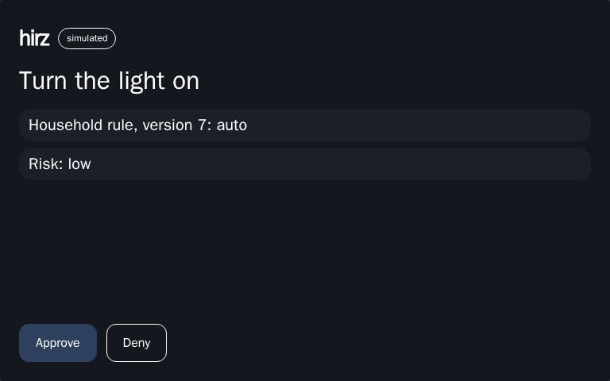

## approval light inline

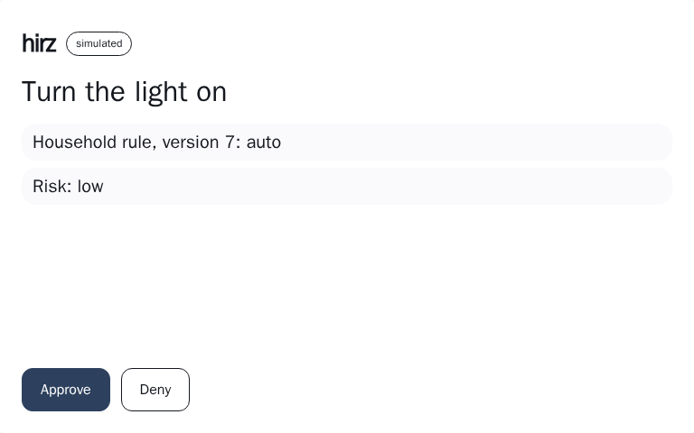

## doorbell dark inline

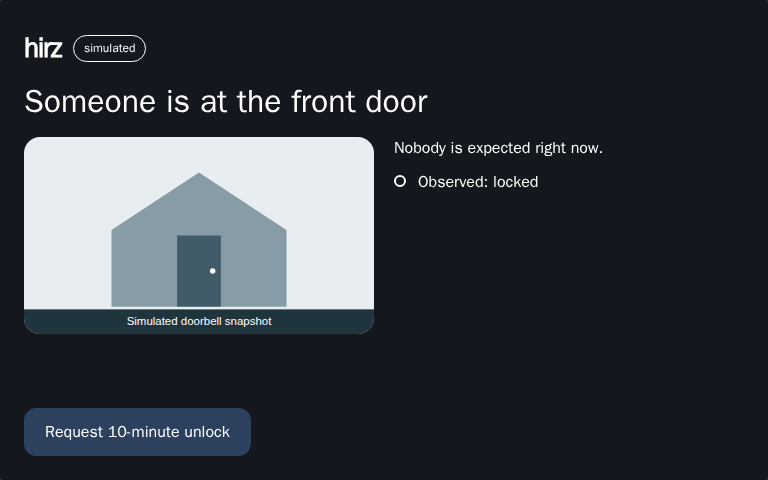

## doorbell light inline

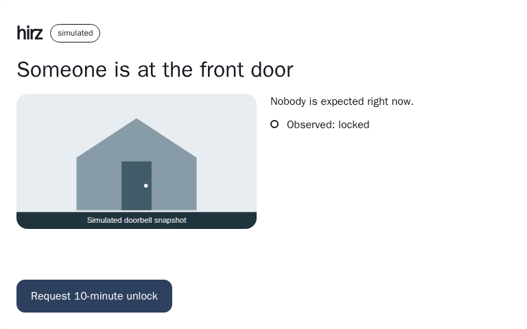

## plan dark fullscreen

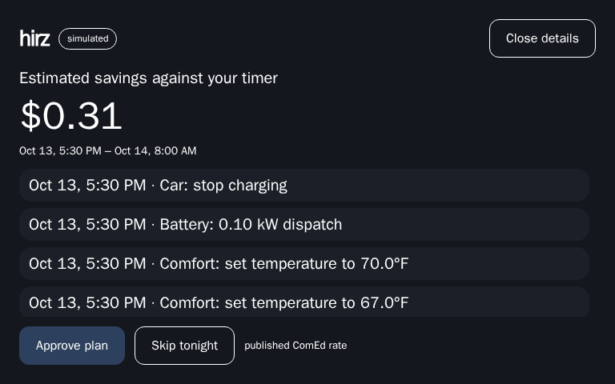

## plan dark inline

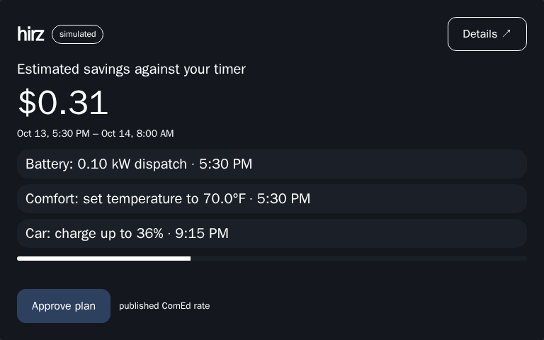

## plan light fullscreen

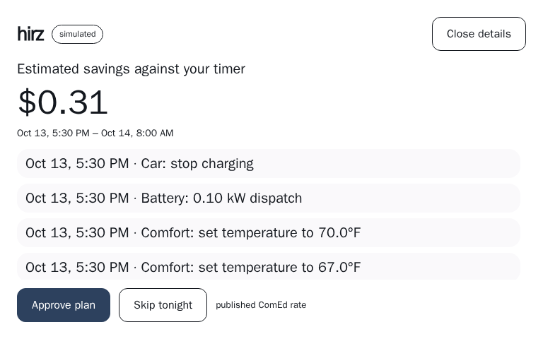

## plan light inline

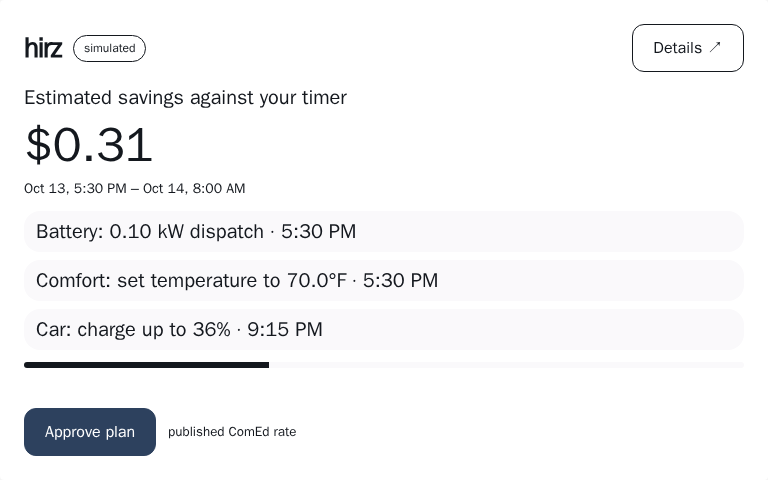

## scorecard dark fullscreen

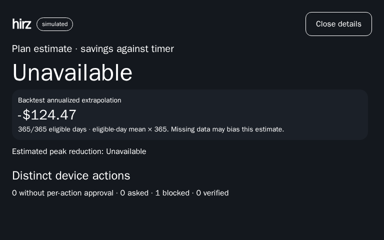

## scorecard dark inline

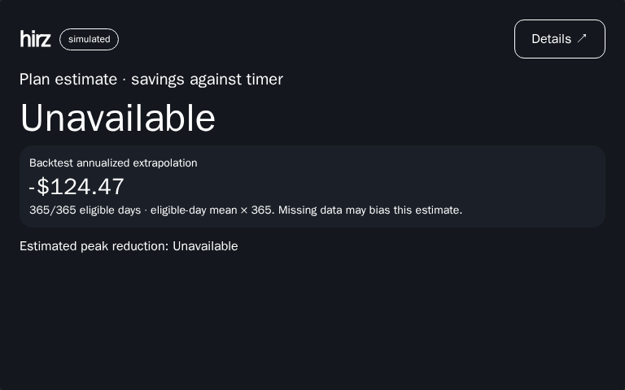

## scorecard light fullscreen

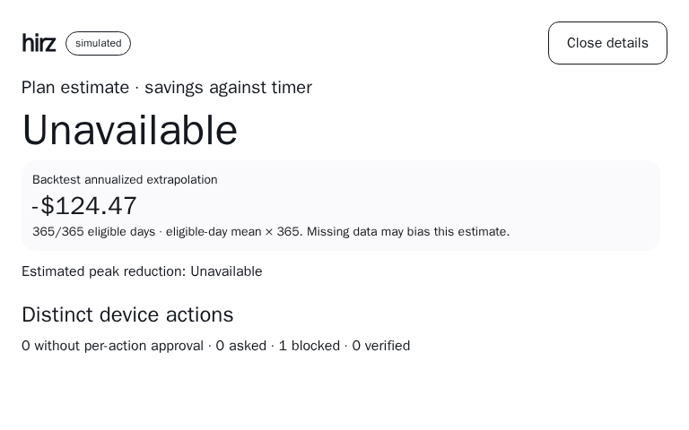

## scorecard light inline

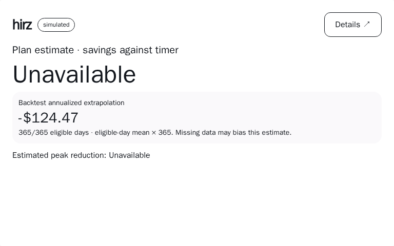

## verification dark inline

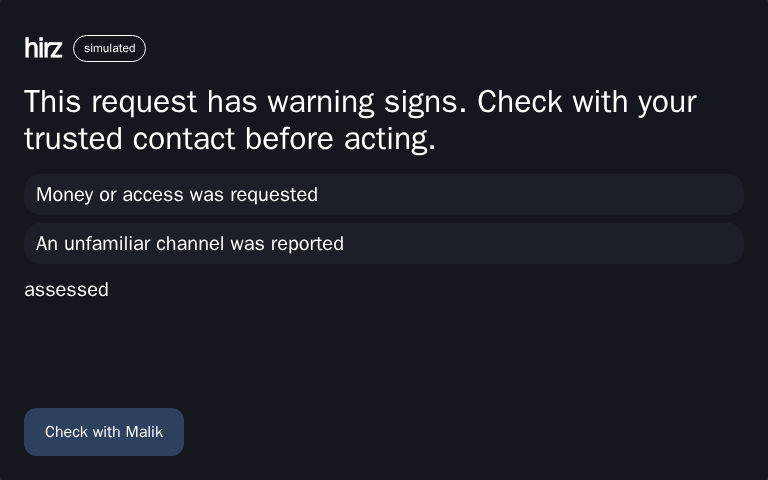

## verification light inline

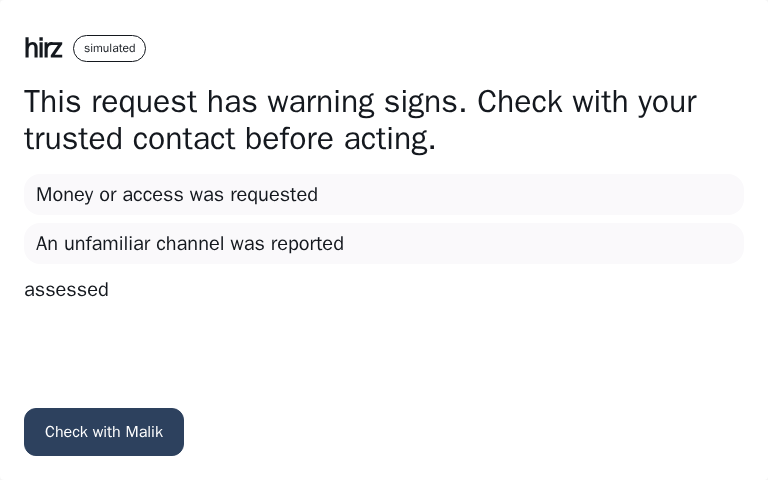
